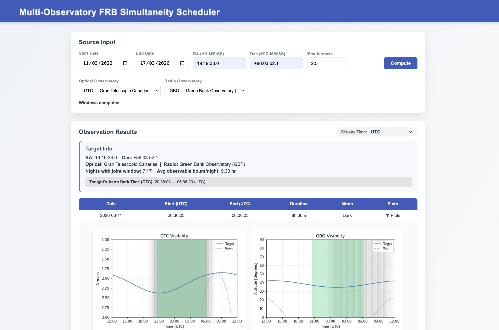
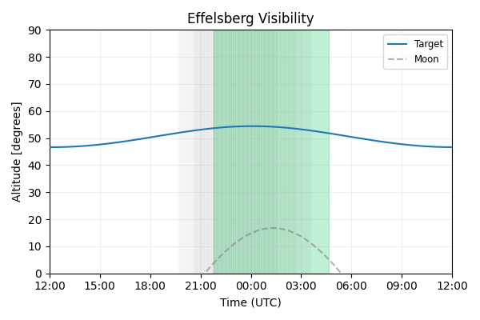
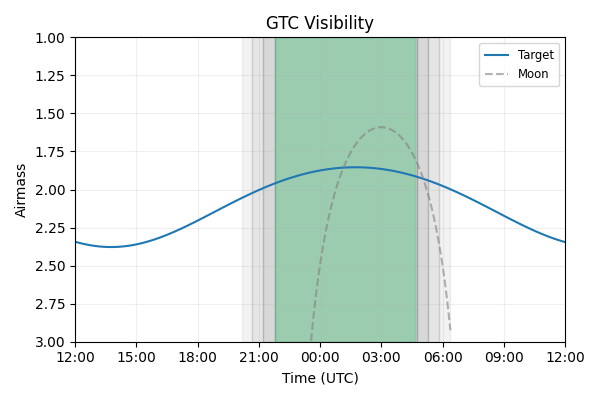
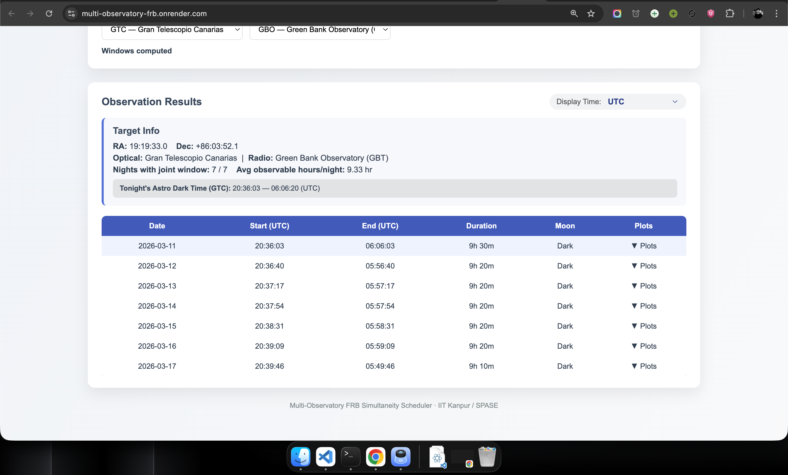
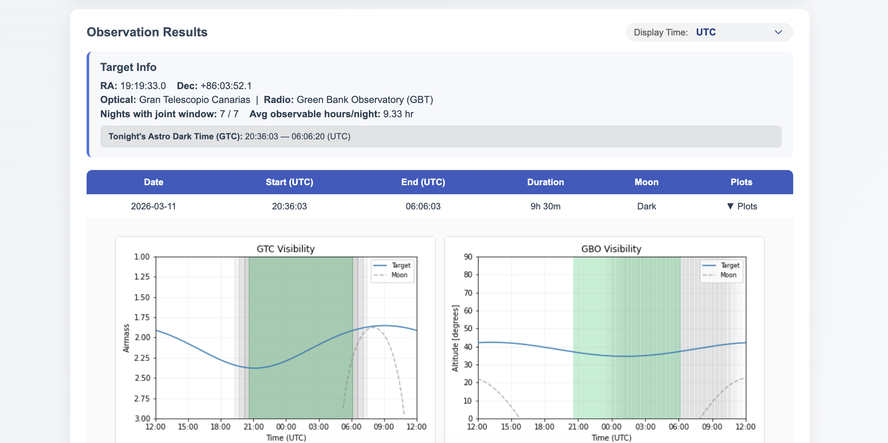

# Multi-Observatory FRB Simultaneity Scheduler

> **Live Tool:** [https://multi-observatory-frb.onrender.com](https://multi-observatory-frb.onrender.com)

A web-based scheduling tool for planning simultaneous radio–optical observations of repeating Fast Radio Bursts (FRBs). Built at the Department of Space, Planetary & Astronomical Sciences and Engineering (SPASE), IIT Kanpur.




## Table of Contents

- [Overview](#overview)
- [Science Motivation](#science-motivation)
- [Features](#features)
- [How The App Works — End to End](#how-the-app-works--end-to-end)
- [Constraints Used](#constraints-used)
- [Function Reference](#function-reference)
- [Supported Observatories](#supported-observatories)
- [Architecture](#architecture)
- [Installation](#installation)
- [Usage](#usage)
- [Project Structure](#project-structure)
- [API Reference](#api-reference)
- [Deployment](#deployment)
- [Known Limitations](#known-limitations)
- [Authors](#authors)

## Overview

This tool computes **joint visibility windows** during which a repeating FRB can be observed simultaneously from a radio telescope and an optical telescope. It generates nightly visibility plots, moon condition assessments, and exportable observing windows — supporting coordinated Target-of-Opportunity (ToO) campaigns.

The primary use case is the approved **GTC/HiPERCAM** ToO program coordinated with **Effelsberg** and/or **GBO** radio observations, targeting known repeating FRBs to search for prompt optical counterparts.

Try it live at: [https://multi-observatory-frb.onrender.com](https://multi-observatory-frb.onrender.com)

## Science Motivation

Fast Radio Bursts (FRBs) are millisecond-duration radio transients with isotropic-equivalent energies of 10³⁸–10⁴⁵ erg. Despite rapid growth in the known FRB population, **no prompt multi-wavelength counterpart has been conclusively detected** from a cosmological FRB.

Several theoretical models predict fast optical emission contemporaneous with the radio burst:

| Model | Predicted E_opt / E_radio |
|-------|--------------------------|
| Magnetospheric coherent emission | 1 – 10³ |
| Magnetar giant flare | 1 – 100 |
| Inverse Compton scattering | 0.1 – 10 |
| External shock afterglow | 0.01 – 100 |
| Fireball breakout | 0.1 – 10 |

Strict simultaneity between radio and optical observations is essential. This scheduler automates the computation of overlapping visibility windows, enabling rapid ToO triggering when a target FRB enters an active burst phase.

### Target FRBs

Five arcsecond-localised repeating FRBs with simultaneous Effelsberg + GTC visibility throughout the July–December 2026 semester:

| FRB Name | RA (J2000) | Dec (J2000) | Redshift | Overlap Window (hrs/day) | Mean Rate (hr⁻¹ at ≥10 Jy ms) |
|----------|-----------|------------|----------|--------------------------|-------------------------------|
| 20180916B | 01:58:00.8 | +65:43:00.3 | 0.034 | 6.6 | 0.2 |
| 20201124A | 05:07:57.6 | +26:11:24.0 | 0.098 | 4.31 | 1.2 |
| 20220912A | 23:09:04.9 | +48:42:25.0 | 0.077 | 6.41 | 0.3 |
| 20240114A | 21:27:39.9 | +04:19:45.7 | 0.131 | 4.44 | 0.1 |
| 20240209A | 19:19:33.0 | +86:03:52.1 | 0.138 | 3.61 | 0.5 |

Overlap window = daily hours during which simultaneous observations are feasible (elevation > 20° at Effelsberg, airmass < 2.5 at GTC), computed for 1 July–31 December 2026.

### Example Visibility Plots

The green-shaded region shows the joint window during which strictly simultaneous observations are feasible.

| Effelsberg (Altitude) | GTC (Airmass) |
|----------------------|---------------|
|  |  |

## Features

- **Joint visibility computation** — finds windows where both radio and optical telescopes can observe simultaneously
- **Astronomical dark time enforcement** — optical observations restricted to sun altitude < −18°
- **Airmass constraint** — configurable maximum airmass for optical telescope
- **Radio elevation constraint** — minimum 5° elevation at radio telescope
- **Moon condition assessment** — classifies each window as Dark / Gray / Bright based on lunar illumination, altitude, and angular separation
- **Nightly visibility plots** — generates airmass (optical) and altitude (radio) plots with moon trajectory and overlap highlighting
- **Three time-axis display modes** — UTC, optical site local time, radio site local time
- **Dynamic observatory selection** — add new observatories in `pipeline.py` without touching any other file
- **Responsive web interface** — works on desktop, tablet, and mobile
- **CSV export** — observation windows saved to `observation_windows.csv` when running in CLI mode
- **Render-ready deployment** — single service handles both frontend and backend

## Screenshots

### Input Form


### Results Table


### Expanded Visibility Plots


### Mobile View


## Working

This section explains what happens from the moment you click **Compute** to when you see the results table. Every step is explained in plain language so anyone can follow.

### 0 — What the user provides

Before computing anything, the user provides five inputs:

| Input | Example | What it means |
|-------|---------|----------------|
| RA | `01:58:00.8` | Right Ascension — where the FRB is on the sky (like longitude on a celestial globe) |
| Dec | `+65:43:00.3` | Declination — how far north/south the FRB is (like latitude on a celestial globe) |
| Start Date | `2026-07-01` | First night to check |
| End Date | `2026-12-31` | Last night to check |
| Max Airmass | `2.5` | How low in the sky the optical telescope is allowed to observe (explained below) |
| Optical Observatory | `GTC` | Which optical telescope to use |
| Radio Observatory | `Effelsberg` | Which radio telescope to use |

The RA and Dec together pinpoint the FRB's fixed position on the sky. This position does not change — what changes every night is *when* (and whether) both telescopes can see it at the same time.

### 1 — Converting coordinates

```python
coord = SkyCoord(ra, dec, unit=(u.hourangle, u.deg), frame="icrs")
```

The RA (given in hours:minutes:seconds) and Dec (given in degrees:arcmin:arcsec) are converted into an `astropy.SkyCoord` object — a standard astronomical coordinate representation in the International Celestial Reference System (ICRS). All subsequent visibility calculations use this object.

### 2 — Building the observer objects

```python
optical_observer, optical_location = build_observer("optical", optical_key)
radio_observer,   radio_location   = build_observer("radio",   radio_key)
```

For each selected observatory, `build_observer()` reads the `OBSERVATORY_REGISTRY` dictionary in `pipeline.py` and creates two objects:

- **`Observer`** (astroplan) — knows the telescope's geographic location and timezone; used to compute sunrise/sunset and twilight times
- **`EarthLocation`** (astropy) — a precise geographic position on Earth; used for coordinate transformations (converting RA/Dec into local altitude and airmass)

Every observatory in the registry has five parameters:

```python
"GTC": {
    "lon": -17.889,              # Longitude in decimal degrees (negative = West)
    "lat": 28.758,               # Latitude in decimal degrees
    "height": 2396,              # Altitude above sea level in metres
    "timezone": "Atlantic/Canary",  # IANA timezone for local time display
    "short": "GTC"               # Short name shown in plots
}
```

### 3 — Looping over each night

```python
for i in range(delta_days):
    date_str = (start_date + timedelta(days=i)).strftime("%Y-%m-%d")
    windows = compute_nightly_windows(coord, date_str, ...)
```

The pipeline loops over every date in the requested range. For each date, it calls `compute_nightly_windows()` which does all the heavy lifting for that one night.

### 4 — Finding the dark window (`get_darkness_window`)

```python
t_start = obs.twilight_evening_astronomical(time_noon, which='next')
t_end   = obs.twilight_morning_astronomical(time_noon, which='next')
```

**What is astronomical dark time?**
The Sun has to be far enough below the horizon for the sky to be truly dark — not just sunset, but at least 18° below the horizon. This is called *astronomical twilight*. Only within this window can faint optical sources be detected reliably.

- `twilight_evening_astronomical` → the moment the Sun crosses −18° going down (start of true darkness)
- `twilight_morning_astronomical` → the moment the Sun crosses −18° coming back up (end of true darkness)

Everything outside this window is completely rejected for optical observations. Radio observations have no such constraint — radio telescopes can and do observe in daytime.

### 5 — Sampling every 10 minutes

```python
times = time_start + np.arange(0, total_minutes, step_min) * u.minute
```

The dark window (typically 6–10 hours depending on season and latitude) is divided into timesteps every **10 minutes**. At each timestep, the pipeline checks whether both telescopes can observe simultaneously. 10 minutes was chosen as a balance between precision and compute time — finer sampling would be more accurate but much slower over a full semester.

### 6 — The joint visibility check (`is_visible_at_time`)

This is the core function. At every 10-minute timestep, **four conditions** must all be true simultaneously:

#### Condition 1 — Sun is far enough below horizon (optical only)
```python
sun_altaz = get_sun(t).transform_to(AltAz(obstime=t, location=opt_loc))
return sun_altaz.alt < -18 * u.deg
```
The Sun's position is computed and transformed into the local horizon coordinate system (`AltAz`) at the optical site. If the Sun is above −18°, the check fails immediately — no further calculations are needed.

#### Condition 2 — Target is above the horizon at the optical site
```python
altaz_gtc = coord.transform_to(AltAz(obstime=t, location=opt_loc))
visible_gtc = (altaz_gtc.alt > 0 * u.deg) and (altaz_gtc.secz <= airmass_limit)
```
The FRB's RA/Dec coordinates are transformed into the local `AltAz` frame at the optical observatory. This gives the **altitude** (angle above the horizon) and **airmass** (see explanation below).

#### Condition 3 — Airmass is within the user-defined limit (optical only)
```python
altaz_gtc.secz <= airmass_limit
```
**What is airmass?**
When you look straight up (altitude = 90°), you are looking through the minimum amount of atmosphere — this is defined as airmass = 1.0. As the target gets lower in the sky, you look through more and more atmosphere. Airmass is approximately equal to `1 / sin(altitude)`, or equivalently `secant(zenith_angle)` — that is why the code uses `.secz` (secant of the zenith angle).

At airmass 2.0, you are looking through twice as much atmosphere as overhead, which means more light is absorbed and scattered — image quality degrades. At airmass 2.5 (the default limit), the target is about 24° above the horizon. Most professional optical programmes use a limit between 1.5 and 2.5 depending on the science requirements.

| Airmass | Altitude (approx.) | Atmosphere crossed |
|---------|-------------------|-------------------|
| 1.0 | 90° (overhead) | 1× |
| 1.5 | 42° | 1.5× |
| 2.0 | 30° | 2× |
| 2.5 | 24° | 2.5× |
| 3.0 | 19° | 3× |

#### Condition 4 — Target is above the minimum elevation at the radio site
```python
altaz_gbo = coord.transform_to(AltAz(obstime=t, location=rad_loc))
visible_gbo = altaz_gbo.alt >= 5 * u.deg
```
Radio telescopes do not use airmass — they simply need the target to be above the horizon (accounting for trees, buildings, and mechanical limits of the dish). A minimum of **5°** is used as a safe elevation floor; below this, ground interference and mechanical limits make observations impractical.

**Why different constraints for optical and radio?**
- Optical telescopes are severely affected by atmospheric distortion, absorption, and sky brightness at low elevations → strict airmass limit
- Radio telescopes are far less affected by atmospheric effects at centimetre/metre wavelengths, but have mechanical lower limits and ground spillover → simple elevation floor

Only timesteps where **all four conditions pass** are kept.

### 7 — Merging timesteps into windows

```python
for t in good_times[1:]:
    if (t - prev).to(u.minute).value <= step_min + 1:
        prev = t   # still part of the same window
    else:
        windows.append((start, prev))   # gap detected — save the window
        start = t
        prev = t
windows.append((start, prev))
```

The list of valid 10-minute timesteps is scanned sequentially. If two consecutive valid timesteps are within 11 minutes of each other (10-minute step + 1-minute tolerance), they are considered part of the same continuous window. When a gap appears, the current window is saved and a new one starts.

**Minimum window filter:**
```python
if duration_hr < 2.0:
    continue   # discard windows shorter than 2 hours
```
Windows shorter than 2 hours are discarded. This is because the observing programme plans 1.5 hr trigger blocks — a shorter window would not be long enough for a scientifically useful observation after accounting for telescope slew time and setup.

### 8 — Moon condition assessment (`determine_moon_condition`)

At the midpoint of each surviving window, the pipeline evaluates the Moon's impact on optical observations. Three quantities are computed:

```python
moon = get_body("moon", t, location=loc)
moon_altaz    = moon.transform_to(AltAz(...))
moon_alt      = moon_altaz.alt.deg          # Moon altitude in degrees
illumination  = moon_illumination(t)        # 0.0 (new moon) to 1.0 (full moon)
separation    = moon.separation(coord).deg  # Angular distance from FRB to Moon
```

**Illumination** measures what fraction of the lunar disc is lit — 0% is new moon (darkest), 100% is full moon (brightest).

**Separation** measures the angular distance on the sky between the Moon and the FRB. Even a bright Moon causes less sky background contamination if it is far away from your target.

The classification logic:

```
IF moon is below the horizon  →  Dark
  (Moon below horizon means no scattered moonlight at all)

ELSE IF separation ≥ 90° AND illumination ≤ 25%  →  Dark
  (Moon is far enough away and dim enough to be negligible)

ELSE IF illumination ≥ 70% AND moon altitude > 10°  →  Bright
  (Bright moon is up — sky background is significantly elevated)

ELSE IF separation ≤ 45°  →  Bright
  (Moon is very close to the target — scattered light directly contaminates)

ELSE  →  Gray
  (Intermediate conditions — some moon impact but usable)
```

This classification directly informs scheduling priority: Dark nights are preferred for faint transient searches, Gray nights are acceptable, Bright nights should be used only if no better alternative exists.

### 9 — Generating visibility plots (`generate_airmass_plot`)

For each night, the pipeline generates **6 plots** — 2 observatories × 3 time-axis variants (UTC, optical local, radio local):

```python
time_grid = time_center + np.linspace(-12, 12, 300) * u.hour
```

A grid of 300 time points spanning 24 hours (noon to noon) is created. At each point:

**For optical telescopes (airmass plot):**
```python
plot_airmass(target, observer, time_midnight, ax=ax, brightness_shading=True)
```
The `astroplan.plot_airmass` function computes the target's airmass at every grid point and plots it. Y-axis is inverted (1.0 at top = best observing conditions). The `brightness_shading` parameter adds grey shading for twilight regions. The Moon's airmass is overlaid as a dashed grey curve.

**For radio telescopes (altitude plot):**
```python
altaz = target.coord.transform_to(AltAz(obstime=time_grid, location=observer.location))
ax.plot(time_grid.plot_date, altaz.alt.deg, ...)
```
The target's altitude in degrees is computed at every timestep and plotted directly. Twilight shading is added manually by computing the Sun's altitude at each point and shading regions accordingly.

**Overlap window highlighting:**
```python
ax.axvspan(t_start.plot_date, t_end.plot_date, color='#2ecc71', alpha=0.3)
```
Each valid joint window is highlighted in green on both plots, so you can visually confirm that the window corresponds to good conditions at both observatories.

All plots are encoded as **base64 PNG strings** and embedded in the JSON response. The browser decodes them with `data:image/png;base64,...` directly in `` tags — no files are written to disk.

### 10 — Returning results to the browser

```python
return {
    "tonight": { "date": ..., "windows": ..., "darkness": ... },
    "next_7_days": [ { "date": ..., "windows": [...], "plot_optical_utc": "...", ... }, ... ],
    "average_observable_hours": ...,
    "optical_obs": { ... },
    "radio_obs":   { ... }
}
```

The full result is serialised to JSON and sent back to the browser. The frontend JavaScript (`renderData()`) reads this JSON and builds the HTML table rows dynamically. When a user clicks a row, the stored base64 image strings are placed into `` tags and displayed without any additional server request.

## Constraints Used

### Summary table

| Constraint | Value | Applies to | Reason |
|------------|-------|-----------|--------|
| Sun altitude | < −18° | Optical only | Astronomical dark time — sky must be truly dark |
| Max airmass | User-defined (default 2.5) | Optical only | Controls image quality and sky brightness |
| Min elevation | ≥ 5° | Radio only | Mechanical limits and ground interference |
| Min window duration | ≥ 2 hours | Both | Match 1.5 hr trigger block with margin |
| Sampling resolution | 10 minutes | Both | Balance between precision and compute time |
| Moon illumination (Dark) | ≤ 25% | Classification only | New-moon regime |
| Moon separation (Dark) | ≥ 90° | Classification only | Moon far from target |
| Moon illumination (Bright) | ≥ 70% | Classification only | Near full moon |
| Moon altitude (Bright) | > 10° | Classification only | Moon significantly above horizon |
| Moon separation (Bright) | ≤ 45° | Classification only | Moon close to target |

### Why radio telescopes have no airmass constraint

Airmass is a measure of atmospheric absorption and turbulence. At optical wavelengths (hundreds of nanometres), even small amounts of extra atmosphere cause significant absorption and image blurring. At radio wavelengths (centimetres), the atmosphere is nearly transparent — water vapour and oxygen absorb only at specific millimetre-wave frequencies, but at L-band (1.4 GHz) or UBB (1.3–6 GHz) the sky is essentially clear regardless of elevation. The main concern for radio telescopes at low elevation is ground spillover (antenna sidelobes picking up thermal emission from the ground), hence the simple 5° floor.

### Why optical telescopes have no simple elevation constraint

Instead of a fixed elevation limit, optical telescopes use **airmass** because it is a continuous and physically meaningful quantity — it directly determines how much signal is lost to atmospheric absorption and how much extra sky background is added. Different science cases tolerate different airmass limits: high-precision photometry may require airmass < 1.5, while a faint transient search may accept up to 2.5.

## Function Reference

This section explains every significant function in `pipeline.py` in plain language.

### `build_observer(obs_type, key)`

**What it does:** Looks up an observatory in `OBSERVATORY_REGISTRY` by type (`"optical"` or `"radio"`) and key (e.g. `"GTC"`), then creates and returns an `astroplan.Observer` and an `astropy.EarthLocation`.

**Why two objects?** `Observer` is used for high-level operations like computing twilight times. `EarthLocation` is used for low-level coordinate transformations (converting RA/Dec to AltAz at a specific time and place).

**Inputs:** `obs_type` (str), `key` (str)
**Returns:** `(Observer, EarthLocation)`

### `get_darkness_window(date, optical_observer, optical_tz_name)`

**What it does:** Given a calendar date and an optical observatory, computes the start and end times of astronomical darkness (sun < −18°) for that night.

**How it works:**
1. Creates a reference time at local noon on the given date
2. Calls `observer.twilight_evening_astronomical(noon, which='next')` → finds when the Sun next crosses −18° going down
3. Calls `observer.twilight_morning_astronomical(noon, which='next')` → finds when the Sun next crosses −18° coming back up
4. Returns both times in UTC and local timezone formats

**Returns:** Dictionary with `start_utc`, `end_utc`, `start_local`, `end_local`

**Edge case:** Near the poles in summer, the Sun may never go below −18° — in this case `astroplan` raises an exception, which is caught and returns `None`, causing that night to be skipped.

### `is_astronomical_dark(t, optical_location)`

**What it does:** A simple True/False check — is the Sun more than 18° below the horizon at the optical site at time `t`?

**How it works:**
```python
sun_altaz = get_sun(t).transform_to(AltAz(obstime=t, location=loc))
return sun_altaz.alt < -18 * u.deg
```
`get_sun(t)` returns the Sun's geocentric position at time `t` using a built-in ephemeris. This is then transformed into the local horizon frame at the observatory's location.

**Returns:** `True` if astronomically dark, `False` otherwise

### `determine_moon_condition(t, coord, airmass_limit, start_date, end_date, optical_location)`

**What it does:** Classifies the Moon's impact on optical observations at time `t` as `"Dark"`, `"Gray"`, or `"Bright"`.

**How it works:**
1. Computes the Moon's position using `get_body("moon", t, location=loc)` — this uses the built-in solar system ephemeris
2. Transforms Moon position to `AltAz` to get its altitude
3. Calls `moon_illumination(t)` from `astroplan` — this computes the fraction of the lunar disc illuminated based on the Sun–Moon–Earth geometry (0.0 = new moon, 1.0 = full moon)
4. Computes `moon.separation(coord)` — the great-circle angular distance between the Moon and the FRB target
5. Applies the classification hierarchy: Dark → Bright → Gray

**Returns:** `"Dark"`, `"Gray"`, or `"Bright"` (str)

### `is_visible_at_time(coord, t, airmass_limit, optical_location, radio_location)`

**What it does:** The core per-timestep check — returns `True` only if ALL visibility conditions are simultaneously satisfied at both observatories.

**How it works:**
1. Calls `is_astronomical_dark(t)` → if False, returns False immediately (short-circuit)
2. Transforms `coord` to `AltAz` at the optical location → checks altitude > 0° AND secz ≤ airmass_limit
3. Transforms `coord` to `AltAz` at the radio location → checks altitude ≥ 5°
4. Returns `True` only if all three pass

**Returns:** `True` / `False`

### `compute_nightly_windows(coord, date_str, airmass_limit, ...)`

**What it does:** Computes all valid joint visibility windows for one specific night.

**How it works:**
1. Calls `get_darkness_window()` to find the dark period
2. Creates a time array from dark start to dark end in 10-minute steps
3. Filters this array using `is_visible_at_time()` → keeps only valid timesteps
4. Merges consecutive valid timesteps into contiguous windows
5. Discards windows shorter than 2 hours
6. For each surviving window, calls `determine_moon_condition()` at the midpoint
7. Formats window start/end in UTC, optical local time, and radio local time

**Returns:** List of window dictionaries, each containing start, end, duration, condition, and local time variants

### `generate_airmass_plot(coord, night_date_str, mode, observer_obj, obs_type, plot_tz, plot_tz_label, windows)`

**What it does:** Generates one visibility plot (PNG encoded as base64) for a given observatory and time-axis mode.

**Parameters of note:**
- `obs_type`: `"optical"` → airmass plot (Y inverted, 1.0 at top); `"radio"` → altitude plot (degrees, 0 at bottom)
- `plot_tz`: A `ZoneInfo` timezone object; determines what times appear on the X-axis labels
- `windows`: List of joint windows to highlight in green

**How it works:**
1. Creates a 24-hour time grid (noon to noon) of 300 points
2. For optical: calls `astroplan.plot_airmass()` which handles the airmass curve internally
3. For radio: manually computes AltAz at each grid point using `coord.transform_to(AltAz(...))`
4. Adds Moon trajectory as dashed grey curve
5. Highlights joint windows with `ax.axvspan()` in green
6. Sets X-axis formatter to `DateFormatter('%H:%M', tz=plot_tz)` so ticks show in the correct timezone
7. Saves to an in-memory buffer (`io.BytesIO`) and encodes as base64

**Returns:** Base64-encoded PNG string (or `None` on error)

### `process_date_range(coord, start_date_str, end_date_str, airmass_limit, optical_key, radio_key)`

**What it does:** Orchestrates the full computation across all nights in the date range.

**How it works:**
1. Builds observer objects once (not once per night — this is important for performance)
2. Loops over every date in the range
3. For each date: calls `compute_nightly_windows()` + calls `generate_airmass_plot()` 6 times (2 observatories × 3 time-axis modes)
4. Assembles a result dictionary for each night regardless of whether a window was found — nights with no window still get plots so the user can see why (e.g. target below airmass limit all night)

**Returns:** List of per-night result dictionaries

### `run_pipeline(ra, dec, start_date, end_date, airmass_limit, optical_key, radio_key)`

**What it does:** The top-level entry point. Validates inputs, builds observers, runs the full date range, and assembles the final JSON-serialisable result.

**How it works:**
1. Parses RA/Dec into `SkyCoord`; returns `{"error": ...}` if invalid
2. Validates `optical_key` and `radio_key` against the registry; returns error if unknown
3. Calls `compute_nightly_windows()` for the first night (tonight) separately for the summary panel
4. Calls `process_date_range()` for the full range
5. Computes `average_observable_hours` across all nights
6. Returns the assembled result dictionary

**Returns:** Full result dictionary that becomes the JSON API response

## Supported Observatories

### Optical

| Key | Name | Location |
|-----|------|----------|
| `GTC` | Gran Telescopio Canarias | La Palma, Spain |
| `VLT` | Very Large Telescope (ESO) | Cerro Paranal, Chile |
| `Keck` | Keck Observatory | Mauna Kea, Hawaii |
| `GeminiN` | Gemini North | Mauna Kea, Hawaii |
| `GeminiS` | Gemini South | Cerro Pachón, Chile |
| `WHT` | William Herschel Telescope | La Palma, Spain |
| `NOT` | Nordic Optical Telescope | La Palma, Spain |

### Radio

| Key | Name | Location |
|-----|------|----------|
| `GBO` | Green Bank Observatory (GBT) | West Virginia, USA |
| `Effelsberg` | Effelsberg 100-m Telescope | Germany |
| `FAST` | Five-hundred-meter Aperture Spherical Telescope | Guizhou, China |
| `Parkes` | Parkes Observatory (Murriyang) | New South Wales, Australia |
| `CHIME` | Canadian Hydrogen Intensity Mapping Experiment | British Columbia, Canada |
| `MeerKAT` | MeerKAT Radio Telescope | Northern Cape, South Africa |
| `WSRT` | Westerbork Synthesis Radio Telescope | Netherlands |
| `uGMRT` | Upgraded Giant Metrewave Radio Telescope | Pune, India |

### Adding a New Observatory

In `pipeline.py`, append to the appropriate sub-dictionary in `OBSERVATORY_REGISTRY`:

```python
"MyTelescope": {
    "full_name": "My Telescope Full Name",
    "lon": 12.345,       # decimal degrees, negative = West
    "lat": -23.456,      # decimal degrees, negative = South
    "height": 2000,      # metres above sea level
    "timezone": "America/Santiago",   # IANA timezone string
    "short": "MYT"       # abbreviation shown in plots and UI
}
```

No other code changes are required. The frontend dropdown and all plot labels update automatically.

## Architecture

```
┌─────────────────────────────────────────────────────┐
│                    Browser (Client)                  │
│                      index.html                      │
│   Input form → fetch /observatories, /compute       │
└─────────────────────┬───────────────────────────────┘
                      │ HTTP (same origin)
┌─────────────────────▼───────────────────────────────┐
│                  server.py (Python)                  │
│   GET /             → serves index.html             │
│   GET /observatories → returns OBSERVATORY_REGISTRY │
│   GET /compute       → calls run_pipeline()         │
└─────────────────────┬───────────────────────────────┘
                      │
┌─────────────────────▼───────────────────────────────┐
│                  pipeline.py                         │
│   run_pipeline()                                     │
│     └── process_date_range()                        │
│           └── compute_nightly_windows()             │
│                 ├── get_darkness_window()           │
│                 ├── is_visible_at_time()            │
│                 └── determine_moon_condition()      │
│           └── generate_airmass_plot() × 6          │
└─────────────────────────────────────────────────────┘
```

**Stack:** Pure Python stdlib HTTP server + astropy + astroplan + matplotlib. No Django, Flask, or Node.js required.

## Installation

### Prerequisites

- Python ≥ 3.10
- pip

### Steps

```bash
# 1. Clone the repository
git clone https://github.com/yourusername/Multi-Observatory-FRB-Simultaneity-Scheduler.git
cd Multi-Observatory-FRB-Simultaneity-Scheduler

# 2. Create and activate a virtual environment (recommended)
python -m venv .venv
source .venv/bin/activate        # macOS / Linux
.venv\Scripts\activate           # Windows

# 3. Install dependencies
pip install -r requirements.txt

# 4. Start the server
python server.py
```

Then open your browser at: **http://localhost:8001**

## Usage

### Web Interface

Visit [https://multi-observatory-frb.onrender.com](https://multi-observatory-frb.onrender.com) or run locally:

1. Set **Start Date** and **End Date** for the observing campaign
2. Enter the target **RA** (HH:MM:SS) and **Dec** (±DD:MM:SS)
3. Set the **Max Airmass** limit for the optical telescope (default 2.5)
4. Select the **Optical Observatory** and **Radio Observatory**
5. Click **Compute**
6. Results appear as a table — click any row to expand the visibility plots
7. Switch between UTC / Optical Local / Radio Local using the **Display Time** selector

### Command-Line Mode

Edit the bottom of `pipeline.py` and run directly:

```python
if __name__ == "__main__":
    res = run_pipeline(
        ra="01:58:00.8",
        dec="+65:43:00.3",
        start_date="2026-07-01",
        end_date="2026-12-31",
        airmass_limit=2.0,
        optical_key="GTC",
        radio_key="Effelsberg"
    )
```

```bash
python pipeline.py
```

Output is printed to terminal and saved to `observation_windows.csv`.

## Project Structure

```
Multi-Observatory-FRB-Simultaneity-Scheduler/
│
├── index.html              # Frontend — single-page web app
├── server.py               # HTTP server — serves frontend + API
├── pipeline.py             # Core computation engine
├── requirements.txt        # Python dependencies
├── README.md               # This file
└── assets/
    ├── effelsberg_visibility.png   # Example Effelsberg altitude plot
    ├── gtc_visibility.png          # Example GTC airmass plot
    └── screenshots/
        ├── 01_input_form.png
        ├── 02_results_table.png
        ├── 03_visibility_plots.png
        └── 04_mobile_view.png
```

## API Reference

### `GET /observatories`
Returns the full observatory registry.

**Response:**
```json
{
  "optical": {
    "GTC": { "full_name": "Gran Telescopio Canarias", "lon": -17.889, ... }
  },
  "radio": {
    "GBO": { "full_name": "Green Bank Observatory (GBT)", "lon": -79.8398, ... }
  }
}
```

### `GET /compute`

**Query Parameters:**

| Parameter | Type | Default | Description |
|-----------|------|---------|-------------|
| `ra` | string | required | Right ascension, HH:MM:SS |
| `dec` | string | required | Declination, ±DD:MM:SS |
| `date` | string | today | Start date, YYYY-MM-DD |
| `end_date` | string | +6 days | End date, YYYY-MM-DD |
| `airmass` | float | 2.5 | Maximum airmass at optical site |
| `optical_obs` | string | `GTC` | Optical observatory key |
| `radio_obs` | string | `GBO` | Radio observatory key |

**Example:**
```
GET /compute?ra=01:58:00.8&dec=+65:43:00.3&date=2026-07-01&end_date=2026-07-07&airmass=2.0&optical_obs=GTC&radio_obs=Effelsberg
```

**Response:** JSON object containing nightly windows, darkness times, base64 plots, and summary statistics.

## Deployment

### Render.com

1. Push all files to a GitHub repository
2. Go to [render.com](https://render.com) → **New → Web Service**
3. Connect your GitHub repo and configure:

| Setting | Value |
|---------|-------|
| Runtime | Python 3 |
| Build Command | `pip install -r requirements.txt` |
| Start Command | `python server.py` |
| Instance Type | Free |

4. **Create Web Service**

Render automatically sets the `PORT` environment variable. `server.py` reads this via `os.environ.get("PORT", 8001)` and binds to `0.0.0.0`, so no additional configuration is needed.

> **Note:** The free tier sleeps after 15 minutes of inactivity. The first request after sleep may take ~30 seconds. Upgrade to the $7/month Starter plan for always-on availability.

### Local Development

```bash
python server.py
# → http://localhost:8001
```

No Live Server or separate frontend server needed — `server.py` serves `index.html` directly at `/`.

## Known Limitations

- **No caching** — each `/compute` request recomputes all nights from scratch; long date ranges (> 3 months) may take 1–2 minutes
- **Single-threaded server** — the Python `http.server` module handles one request at a time; not suitable for concurrent multi-user access at scale
- **UBB data volume note** — for Effelsberg UBB full-Stokes filterbank at 32 µs / 500 kHz, data rate is ~4.7 TB/hr; offline reduction at MPIfR is recommended

## Authors

**Mohd Intakhab Alam** — M.Tech, SPASE, IIT Kanpur

**Prof. Mohit Bhardwaj** — Assistant Professor, SPASE, IIT Kanpur

## License

MIT License — free to use, modify, and distribute with attribution.